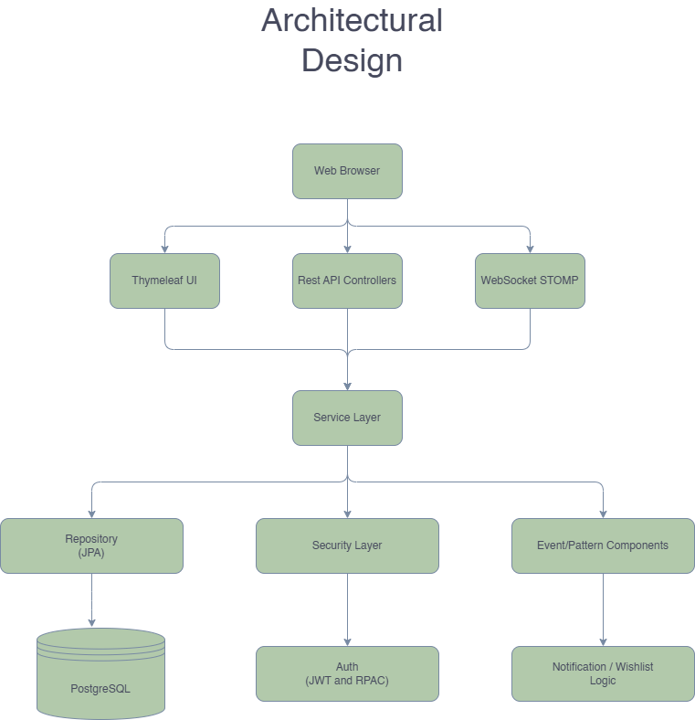
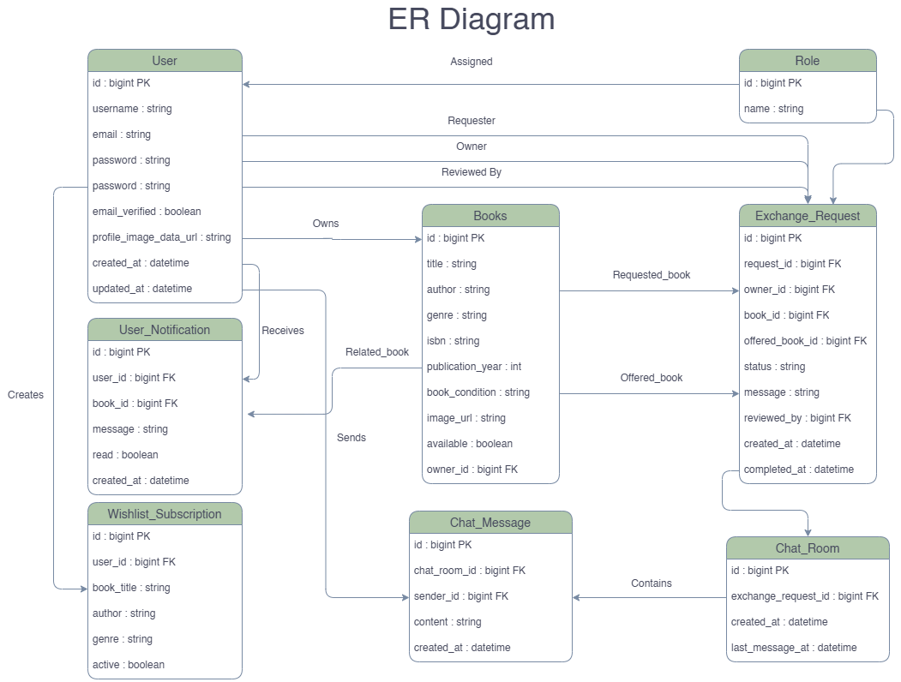

# Book Exchange SEPM

A full-stack Spring Boot platform for exchanging books between users, with moderator workflow, real-time exchange chat, wishlist notifications, and an admin dashboard.

## Table of Contents

- [Project Description](#project-description)
- [Why This Project](#why-this-project)
- [Core Features](#core-features)
- [Tech Stack](#tech-stack)
- [Architecture Diagram](#architecture-diagram)
- [ER Diagram](#er-diagram)
- [API Endpoints](#api-endpoints)
- [Examples of Use](#examples-of-use)
- [Run Instructions](#run-instructions)
- [CI/CD Explanation](#cicd-explanation)
- [Security Model Summary](#security-model-summary)
- [Project Status](#project-status)
- [Default URLs](#default-urls)
- [Notes](#notes)
- [Sources](#sources)
- [Other Information](#other-information)

## Project Description

Book Exchange SEPM lets users list books, request exchanges, and complete ownership transfers in a controlled flow:

1. User lists owned books.
2. Another user requests an exchange by offering one of their own books.
3. Moderator reviews and approves/rejects requests.
4. Delivery role supports handoff/logistics coordination.
5. Participants accept and complete exchange.
6. Chat and notifications support coordination.

## Why This Project

This project was built to practice end-to-end software engineering with a realistic domain workflow: authentication, role-based authorization, transactional state transitions, and real-time communication. It is also designed as a portfolio-quality repository with production-style deployment and CI setup.

### Core Features

- Registration/login (form and API)
- Role-based access (USER, DELIVERY, MODERATOR, ADMIN)
- Book management (CRUD + availability)
- Exchange workflow lifecycle management
- Delivery coordination support in the exchange lifecycle
- WebSocket + REST fallback chat for exchange rooms
- Wishlist subscriptions and notification feed
- Admin dashboard and management APIs

### Scope of Functionalities

- User account lifecycle: registration, verification, login, profile updates
- Book listing lifecycle: create, browse, update, mark unavailable, remove
- Exchange lifecycle: request, moderation, participant acceptance, completion
- Communication lifecycle: exchange-specific chat rooms and message history
- Discovery lifecycle: wishlist subscriptions and event-driven notifications
- Operations lifecycle: admin UI controls, CI tests, Docker/Render deployment

## Tech Stack

- Java 17
- Spring Boot 4.0.3
- Spring MVC + Thymeleaf
- Spring Security + JWT + HTTP Basic + form login
- Spring Data JPA + PostgreSQL
- Spring WebSocket (STOMP + SockJS)
- Maven Wrapper
- Docker and Docker Compose
- GitHub Actions (CI)

## Architecture Diagram



The image above is the canonical architecture diagram used for this repository.

## ER Diagram



The image above is the canonical ER diagram used for this repository.

## API Endpoints

Base API path: `/api`

### Auth

- `POST /api/auth/register` - Register user
- `POST /api/auth/login` - Login user
- `GET /api/auth/verify-email` - Verify email token

### User

- `GET /api/user/profile` - Current user profile
- `PUT /api/user/profile-image` - Update profile image
- `GET /api/user/dashboard` - User dashboard payload

### Books

- `POST /api/books` - Create book
- `GET /api/books` - List books
- `GET /api/books/{id}` - Get book by id
- `GET /api/books/available` - List available books
- `GET /api/books/my-books` - List current user books
- `PUT /api/books/{id}` - Update book
- `DELETE /api/books/{id}` - Delete book
- `PATCH /api/books/{id}/availability` - Change availability

### Exchange Requests

- `POST /api/exchange-requests` - Create request
- `GET /api/exchange-requests/my-book-requests` - Requests on my books
- `GET /api/exchange-requests/my-requests` - Requests created by me
- `GET /api/exchange-requests/moderation/pending` - Pending moderation queue
- `GET /api/exchange-requests/{id}` - Request details
- `PATCH /api/exchange-requests/{id}/approve` - Approve request (moderator)
- `PATCH /api/exchange-requests/{id}/reject` - Reject request (moderator)
- `PATCH /api/exchange-requests/{id}/accept` - Participant accept
- `PATCH /api/exchange-requests/{id}/cancel` - Cancel request
- `PATCH /api/exchange-requests/{id}/complete` - Complete exchange and transfer ownership

### Exchange Chat

- `GET /api/exchange/{exchangeRequestId}/messages` - Fetch room messages
- `POST /api/exchange/{exchangeRequestId}/messages` - Send message (HTTP fallback)
- `GET /api/exchange/my-chats` - Active chat rooms
- `GET /api/exchange/{exchangeRequestId}/chat` - Chat room details

WebSocket messaging:

- STOMP endpoint: `/ws` (also `/ws-chat`)
- App destination: `/app/exchange/{exchangeRequestId}/send`
- Topic subscription: `/topic/chat/{exchangeRequestId}`

### Wishlist and Notifications

- `POST /api/wishlist/subscribe` - Add wishlist subscription
- `GET /api/wishlist/my` - List my wishlist subscriptions
- `PATCH /api/wishlist/{id}/deactivate` - Deactivate wishlist item
- `GET /api/notifications/my` - List my notifications
- `PATCH /api/notifications/{id}/read` - Mark notification as read

### Moderator and Admin

- `DELETE /api/moderator/books/{id}` - Moderator deletes book
- `GET /api/moderator/dashboard` - Moderator dashboard
- Admin pages and data endpoints are mounted under `/admin/**`

## Examples of Use

### Register a New User

```bash
curl -X POST http://localhost:8080/api/auth/register \
	-H "Content-Type: application/json" \
	-d '{
		"username": "new_user",
		"email": "new_user@example.com",
		"password": "password123"
	}'
```

### Login

```bash
curl -X POST http://localhost:8080/api/auth/login \
	-H "Content-Type: application/json" \
	-d '{
		"username": "new_user",
		"password": "password123"
	}'
```

### Create a Book (Authenticated)

```bash
curl -X POST http://localhost:8080/api/books \
	-H "Authorization: Basic <base64-credentials>" \
	-H "Content-Type: application/json" \
	-d '{
		"title": "Clean Code",
		"author": "Robert C. Martin",
		"genre": "Software Engineering",
		"language": "English",
		"isbn": "9780132350884",
		"publicationYear": 2008,
		"bookCondition": "GOOD",
		"description": "A practical guide to writing maintainable code."
	}'
```

### Create an Exchange Request

```bash
curl -X POST http://localhost:8080/api/exchange-requests \
	-H "Authorization: Basic <base64-credentials>" \
	-H "Content-Type: application/json" \
	-d '{
		"bookId": 10,
		"offeredBookId": 22,
		"message": "Interested in exchanging this week."
	}'
```

## Run Instructions

### Prerequisites

- Java 17+
- Maven wrapper (`mvnw` or `mvnw.cmd`)
- PostgreSQL (for local DB mode)
- Optional: Docker Desktop

### 1. Local Run (Windows)

1. Configure environment variables:
   - `SPRING_DATASOURCE_URL` (example: `jdbc:postgresql://localhost:5432/book_exchange`)
   - `SPRING_DATASOURCE_USERNAME`
   - `SPRING_DATASOURCE_PASSWORD`
   - Optional: `SPRING_JPA_HIBERNATE_DDL_AUTO=update`
   - Optional: `SERVER_PORT=8080` (default in `application.yaml` is 8081)
2. Start app:

```powershell
.\mvnw.cmd spring-boot:run
```

### 2. Local Run (Linux/macOS)

```bash
./mvnw spring-boot:run
```

### 3. Docker Compose Run

1. Create `.env` in project root with:

```env
POSTGRES_DB=book_exchange
POSTGRES_USER=postgres
POSTGRES_PASSWORD=postgres
APP_PORT=8080
POSTGRES_PORT=5432
SPRING_JPA_HIBERNATE_DDL_AUTO=update
```

2. Start containers:

```bash
docker compose up --build
```

### 4. Build and Test

```bash
./mvnw clean test
./mvnw verify
```

PowerShell helper scripts are also available:

- `test-api.ps1`
- `full-test-suite.ps1`

## CI/CD Explanation

### CI (GitHub Actions)

Workflow file: `.github/workflows/ci.yml`

Pipeline stages:

1. `unit-tests` job
   - Runs on `ubuntu-latest`
   - Sets up Temurin JDK 17
   - Caches Maven dependencies
   - Executes `./mvnw clean test`
2. `integration-tests` job (depends on unit-tests)
   - Runs `./mvnw -DskipUnitTests=true verify`

Trigger conditions:

- Push to any branch
- Pull request events

### CD/Deployment

- `render.yaml` is included for Render deployment with Docker runtime.
- `Dockerfile` performs a multi-stage build:
  - Build stage packages Spring Boot app with Maven
  - Runtime stage runs only JRE with generated jar
- Render is configured with `autoDeploy: true`, so new commits can automatically redeploy.

## Security Model Summary

- Public routes: login/register/verify-email/static assets and websocket handshake endpoints
- API authorization enforced by URL rules and method-level `@PreAuthorize`
- Session support for form login plus JWT filter and HTTP Basic support for API/testing use cases
- Roles currently used in the system:
	- USER: core marketplace actions (books, requests, chat, wishlist, notifications)
	- DELIVERY: delivery/handoff coordination responsibilities
	- MODERATOR: request moderation and moderation-specific operations
	- ADMIN: admin pages, admin APIs, and platform operations
- Role gates:
	- USER/DELIVERY/MODERATOR/ADMIN for core user APIs
	- DELIVERY for delivery coordination tasks
	- MODERATOR for moderation APIs
	- ADMIN for admin APIs/pages

### Role Matrix

| Capability | USER | DELIVERY | MODERATOR | ADMIN |
|---|---|---|---|---|
| Browse and manage own books | Yes | Yes | Yes | Yes |
| Create and track exchange requests | Yes | Yes | Yes | Yes |
| Exchange chat and notifications | Yes | Yes | Yes | Yes |
| Delivery and handoff coordination | No | Yes | Yes | Yes |
| Moderate pending exchange requests | No | No | Yes | Yes |
| Access admin UI and admin APIs | No | No | No | Yes |

## Project Status

Active and maintained.

- Core exchange flow is implemented and integrated.
- CI pipeline is configured and running on GitHub Actions.
- Docker-based local/prod-like deployment is available.
- Planned improvements: richer API docs and broader automated integration coverage.

## Default URLs

- Local app: `http://localhost:8081` (or `http://localhost:8080` if `SERVER_PORT=8080`)
- Login page: `/login`
- Browse page: `/browse`
- Admin pages: `/admin`

## Notes

- The repository also contains extended documentation in:
  - `DESIGN_PATTERNS.md`
  - `IMPLEMENTATION_COMPLETE.md`
  - `TESTING_GUIDE.md`
  - `RENDER_DEPLOY.md`
- Diagram source assets are stored in `docs/`:
	- `docs/architecture.png`
	- `docs/er_diagram.png`

## Sources

- Spring Boot documentation: https://docs.spring.io/spring-boot/
- Spring Security documentation: https://docs.spring.io/spring-security/
- Spring WebSocket messaging guide: https://spring.io/guides/gs/messaging-stomp-websocket/
- PostgreSQL documentation: https://www.postgresql.org/docs/

## Other Information

- Primary language for project documentation: English
- If you use this repository for coursework or extension work, keep API and schema updates reflected in this README
